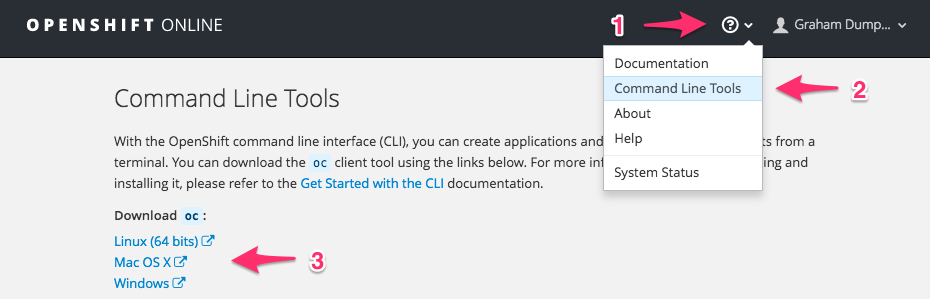
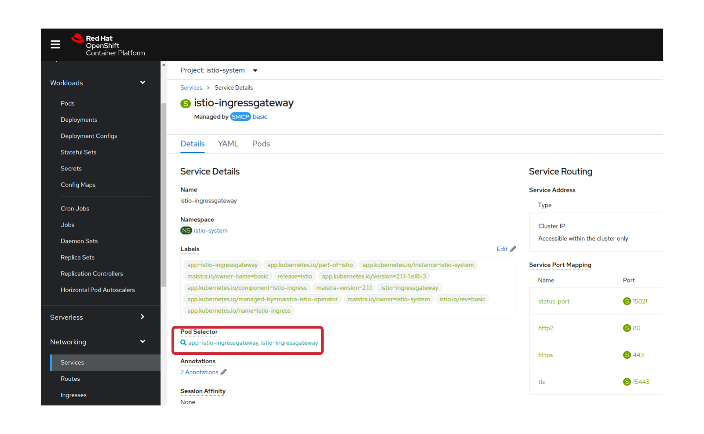
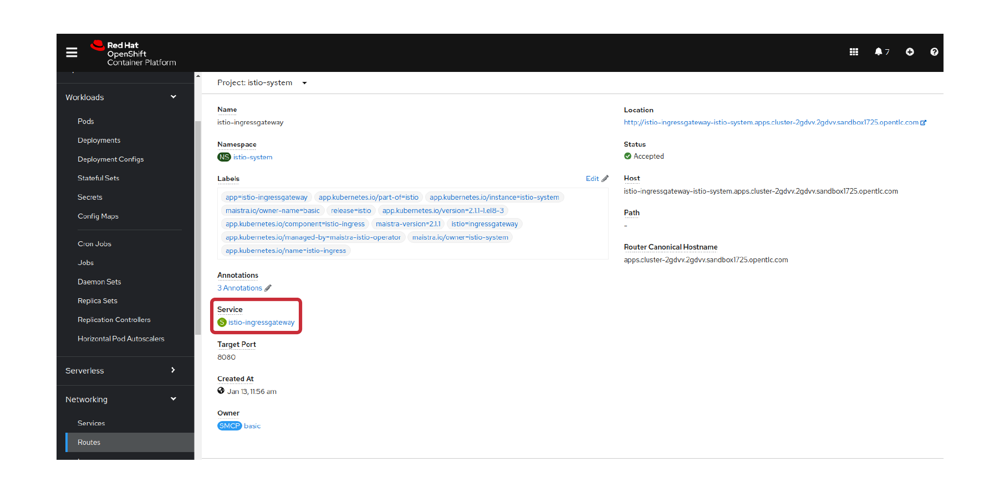
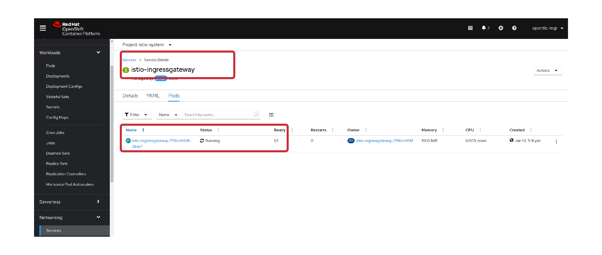
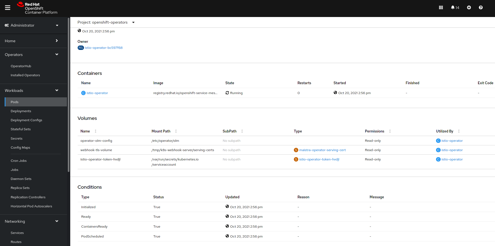
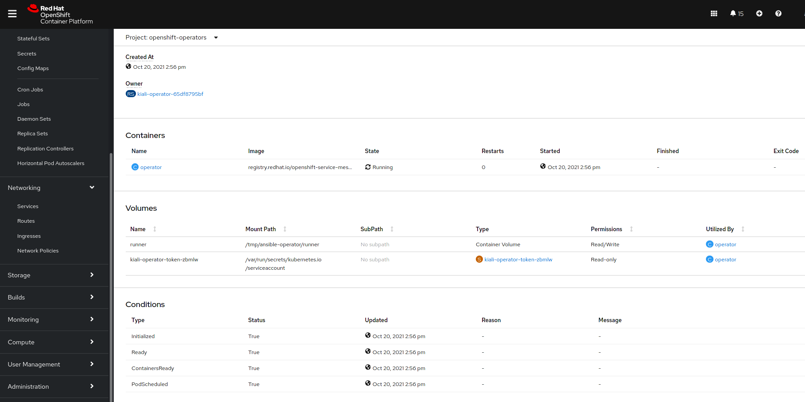
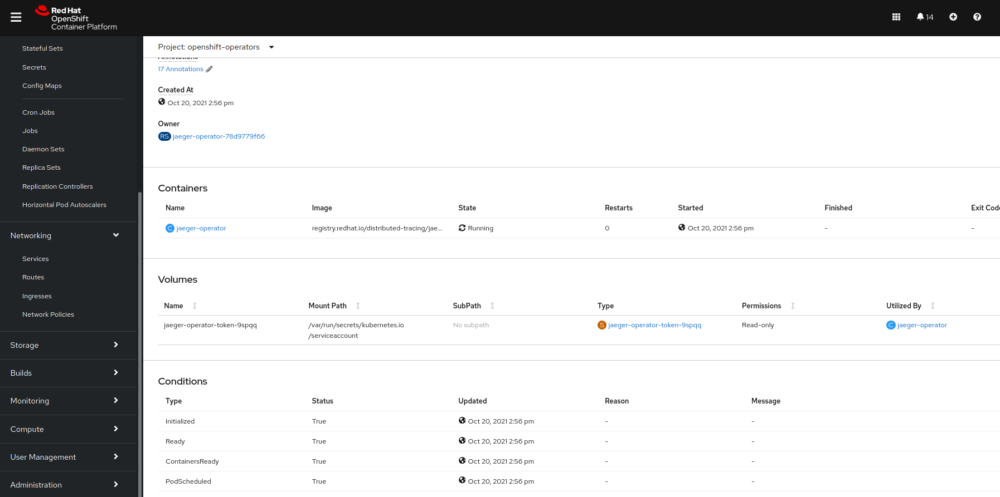
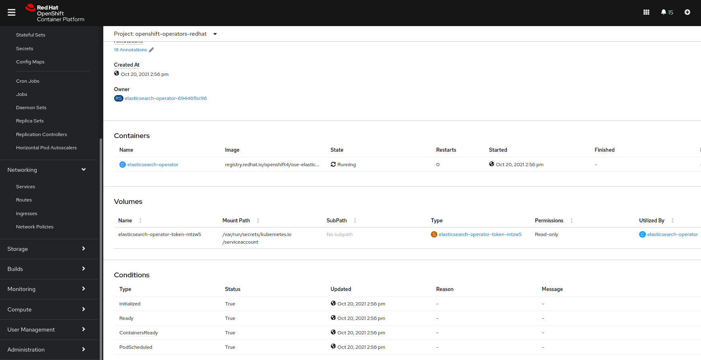

= Troubleshooting and Debugging Actions
:toc:

== Tool Prerequisites

=== oc 
CLI to interact with OCP Cluster

=== kubectl
CLI to interact with OCP Cluster can be downloaded from link:https://kubernetes.io/docs/tasks/tools/#kubectl[Download kubctl]

=== istioctl
CLI to interact with Service Mesh sidecar (Envoy Proxy). Can be downloaded from and setup:

	wget https://github.com/istio/istio/releases/download/1.6.14/istioctl-1.6.14-linux-amd64.tar.gz
	tar xzf istioctl-1.6.14-linux-amd64.tar.gz

=== jq

*jq* command useful for transformations that are too complex for jsonpath.| Download at https://stedolan.github.io/jq/

== 1 - OpenShift Cluster Actions

=== CPU & RAM Nodes Inspection
* See all cluster nodes CPU and Memory requests and limits. See for visualisation

	oc describe nodes | grep -A 3 "Name:\|Resource .*Requests .*Limits" | grep -v "Roles:"

* See all cluster nodes load (top)

	kubectl top nodes

=== Nodes, Machine Configs and States
* Check nodes and state (all should be in “Ready” state) see Nodes State Console View for visualization

	oc get node

* Check machineconfig and machine states

	oc get machineconfigpool

=== Cluster Events
* Events for the whole cluster

	oc get events

* Events in a specific namespace
	
	oc get events -n <namespace-name>

* Events for a specific POD

	oc get event --namespace <namespace-name> --field-selector involvedObject.name=<pod-name>

=== Cluster Router

* Check PODs for the Router are up and running

	oc -n openshift-ingress get deployment

=== Internal Registry

* Check Internal Registry running

	oc -n openshift-image-registry get deployment

Check Internal Registry connectivity

	curl -i https://default-route-openshift-image-registry.apps.<CLUSTER-DOMAIN>.com

== 2 - Openshift Deployments Actions

[[anchor-5]]
=== POD Replicas Desired/Created

* Check ReplicaSet Details for the deployments

	for depname in $(oc get deployment --output=jsonpath={.items..metadata.name} -n <namespace-name>); do echo "=================== ${depname} ==================="; oc describe deployment/$depname |grep -A 20 "Conditions:"; done

	=================== greeter-00001-deployment ===================
	Conditions:
	  Type           Status  Reason
	  ----           ------  ------
	  Progressing    True    NewReplicaSetAvailable
	  Available      True    MinimumReplicasAvailable
	OldReplicaSets:  <none>
	NewReplicaSet:   greeter-00001-deployment-87b6675d9 (0/0 replicas created)
	Events:          <none>
	=================== hello-00001-deployment ===================
	Conditions:
	  Type           Status  Reason
	  ----           ------  ------
	  Progressing    True    NewReplicaSetAvailable
	  Available      True    MinimumReplicasAvailable
	OldReplicaSets:  <none>
	NewReplicaSet:   hello-00001-deployment-766d88749b (1/1 replicas created)
	Events:
	  Type    Reason             Age                From                   Message
	  ----    ------             ----               ----                   -------
	  Normal  ScalingReplicaSet  9h (x7 over 16h)   deployment-controller  Scaled down replica set hello-00001-deployment-766d88749b to 0
	  Normal  ScalingReplicaSet  9h (x7 over 16h)   deployment-controller  Scaled up replica set hello-00001-deployment-766d88749b to 1
	  Normal  ScalingReplicaSet  41m (x5 over 89m)  deployment-controller  Scaled down replica set hello-00001-deployment-766d88749b to 0
	  Normal  ScalingReplicaSet  41m (x5 over 89m)  deployment-controller  Scaled up replica set hello-00001-deployment-766d88749b to 1

* Check Replicas Current/Desired 

	for rc in $(for pname in $(oc get pods --output=jsonpath={.items..metadata.name} -n <namespace-name>); do oc describe pod/$pname  |grep -A 0 "Controlled By" |sed 's/^[^/]*://g'; done); do echo "=================== ${pname} ==================="; oc describe $rc |grep -A 0 "Replicas"; done

	=================== hello-00002-deployment-8594b88f7c-rqm87 ===================
	Replicas:       1 current / 1 desired
	=================== hello-00002-deployment-8594b88f7c-rqm87 ===================
	Replicas:       1 current / 1 desired

=== POD Restarts

* POD Restarts for all pods (Taken from kubectl cheatsheet)

	oc get pods -A --sort-by='.status.containerStatuses[0].restartCount'

=== PersistentVolume and PersitentVolumeClaim State

* Check PVs and PVCs state and ensure Status for expected PV/PVC is “Bound”

	oc get pv -n <namespace>
	oc get pvc -n <namespace-name>

* link:https://docs.openshift.com/container-platform/4.7/virt/logging_events_monitoring/virt-diagnosing-datavolumes-using-events-and-conditions.html[Diagnosing data volumes using events and conditions]
* Space left in PV (Best to check on overall storage availability)
  ** If ‘df’ exists in the POD

	kubectl -n <namespace-name> exec <pod-name> -- df -h
      
=== StorageClass Availability & Configuration

* Check StorageClass exists, if default, VolumeBindingMode

	oc get StorageClass

* Check StorageClass characteristics

	oc describe StorageClass <storageclass-name>

=== Check Resource Quotas & Limit Ranges

* ResourceQuota sets aggregate quota restrictions enforced per namespace and can be found in OCP Console <CONSOLE-URL>/k8s/ns//openshift-machine-api/resourcequotas

	apiVersion: v1
	kind: ResourceQuota
	metadata:
	 name: example
	 namespace: cicd
	spec:
	 hard:
	   pods: '4'
	   requests.cpu: '1'
	   requests.memory: 1Gi
	   limits.cpu: '2'
	   limits.memory: 2Gi

* LimitRange sets resource usage limits for each kind of resource in a Namespace and can be found in OCP Console `<CONSOLE-URL>/k8s/ns/openshift-machine-api/limitranges`

	apiVersion: v1
	kind: LimitRange
	metadata:
	 name: mem-limit-range
	 namespace: cicd
	spec:
	 limits:
	   - default:
	       memory: 512Mi
	     defaultRequest:
	       memory: 256Mi
	     type: Container

=== POD Deployment Location

* Check the worker node service is deployed at

	oc get pod -o wide

* Check the WorkerNode the POD (Affinity) prefers to deploy on

	oc get $(oc describe pod/<pod-name>  |grep -A 0 "Controlled By" |sed 's/^[^/]*://g';) --output=jsonpath={.spec.template.spec.affinity.nodeAffinity.requiredDuringSchedulingIgnoredDuringExecution.nodeSelectorTerms} |jq

[[anchor-6]]
=== POD Defined Tolerations

* Read documentation on link:https://docs.openshift.com/container-platform/4.9/nodes/scheduling/nodes-scheduler-taints-tolerations.html[Controlling pod placement using node taints]
* Check if POD defined toleration are matched

	oc describe pod istio-ingressgateway-766bbd5894-q8vdn |grep -A 3 "Tolerations:"

	Tolerations:     ien=false:NoExecute
		         node.kubernetes.io/memory-pressure:NoSchedule op=Exists
		         node.kubernetes.io/not-ready:NoExecute op=Exists for 300s
		         node.kubernetes.io/unreachable:NoExecute op=Exists for 300s

=== Selectors Validation

== 3 - Service Mesh

=== Check versions of Service Mesh Components
* Service Mesh Operator Version
	
	oc get deploy istio-operator -n openshift-operators -o yaml | grep 'olm.owner:'

* Service Mesh Control Plane Version
	
	oc get configmap/istio-basic -n istio-system -oyaml | awk -v n=2 '/apiVersion/{l++} l==n' | jq .metadata.labels.'"maistra-version"'

* Service Mesh Control Plane Ingress/Egress Envoy Version

	for dp in $(oc get deployments -n istio-system -o jsonpath='{range .items[*]}{.metadata.name}{"\n"}{end}'); do
	 if [[ $dp == istio-* ]]; then
	 ver=$(oc -n istio-system get deploy ${dp} -o jsonpath='{ .metadata.labels.maistra-version }')
	 echo "${dp} - ${ver}"
	 fi
	done

=== Check & Set Logging Levels of Service Mesh Components
* link:https://access.redhat.com/documentation/en-us/openshift_container_platform/4.7/html-single/service_mesh/index#enabling-envoy-access-logs[Enabling Envoy access logs] for the whole Service Mesh (ie. `istio-proxy` containers and ingress/egress gateways)
* link:https://access.redhat.com/solutions/6106461[How to change log level of specific components or protocols on the istio-proxy sidecar]

	./istioctl proxy-config log my-app.my-app-project  (checking istio-proxy Log Levels)
	./istioctl proxy-config log my-app.my-app-project --level http2:debug,grpc:debug (setting istio-proxy Log Levels)
	./istioctl proxy-config log my-app.my-app-project -r (resetting istio-proxy Log Levels)

=== POD is in the Service Mesh
* Does the POD have a `istio-proxy` sidecar?
	
	oc get pod/<pod-name> -o jsonpath='{.spec.containers[*].name}{"\n"}'

* Has the POD been instructed with annotation `sidecar.istio.io/inject": "true"` to have a `istio-proxy` sidecar?
	
	oc get pod/<pod-name> --output=jsonpath={.metadata.annotations}

* Is the project/namespace in the service mesh?
** What is a `ServiceMeshMemberRole` and how do I view it? 
*** The `ServiceMeshMemberRole (smmr)` resource defines the namespaces that a service mesh control plane monitors. The `smmr` lives in the `istio-system` namespace and should be named default. The smmr can be viewed a few different ways. The general method is:

	oc get smmr default -n istio-system -o yaml

* Overriding Network Policies
** Check if any unexpected `NetworkPolicy` configurations exist in the namespace the POD belongs to. 
*** `allow-from-all-namespaces` and `allow-from-ingress-namespace` are installed by default in every namespace when using OpenShift SDN mode. The policies allow traffic between all pods in all namespaces, as well as ingress to pods through the router
*** `istio-mesh` and `istio-expose-route` are created when adding the namespace to the service mesh.

* Test Connectivity between services
** If possible 

	oc rsh <pod-name>
	curl <service-name>:<port> (per VirtualService settings)

=== Service Mesh Control Plane configuration

* Get the details of the SMCP configuration

	oc get smcp -n istio-system
	oc get smcp <smcp-name> -n istio-system -o yaml

* Understand the configuration based on the description of the link:https://access.redhat.com/documentation/en-us/openshift_container_platform/4.9/html-single/service_mesh/index#ossm-reference[OSSM Reference] and link:https://github.com/maistra/istio-operator/blob/maistra-2.0/docs/crd/CRDS.adoc[OSSM CRDs]

=== Service Mesh Certificates 
* Check via link:https://kiali.io/docs/features/security/[KIALI the security settings for the SMCP (mtls)]
* Check from xref:anchor-1[Service Mesh Control Plane State] the configurations around certificates handling in this service mesh
* Understand link:https://docs.openshift.com/container-platform/4.6/service_mesh/v2x/ossm-security.html[Service Mesh Control Plane Security Settings] (note: by default SM handles creation/rotation of certs for MTLs within the mesh only. Inbound/Outbound mTLS requires further config in `Gateway`/`DestinationRule`/`ServiceEntry` configurations, see also xref:anchor-2[Service Mesh External (in/out) Network Configurations] as well ensuring clients/service certificates are signed by the same authority)

[[anchor-2]]
=== Service Mesh External (in/out) Network Configurations
* Calls to external Services ONLY allowed if `ServiceEntry` is defined for that endpoint and calls go through the Egress Gateway
** See  xref:anchor-3[Appendix B: Service Mesh external traffic directed via Egress Gateway]
* Service Mesh `Gateway` Resource and `VirtualService` is configured to allow external access to service in the mesh
** See xref:anchor-4[Appendix C: Service Mesh external traffic directed to mesh included service]

[[anchor-1]]
=== Service Mesh Operator State
* Check State of Service Mesh operator POD 
** _istio-operator_ POD in openshift-operators namespace

	oc logs -f <istio-operator POD> -n openshift-operators

** Check conditions below
+

+
* Check State of Service Mesh KIALI operator POD
** _kiali-operator_ POD in openshift-operators namespace

	oc logs -f <kiali-operator POD> -n openshift-operators

** Check conditions below
+

+
* Check State of Service Mesh Jaeger operator POD
** _jaeger-operator_ POD in openshift-operators namespace

	oc logs -f <jaeger-operator POD> -n openshift-operators

** Check conditions below
+

+
* Check State of Service Mesh ElasticSearch operator POD
** _elasticseacrch-operator_ POD in openshift-operators-redhat namespace

	oc logs -f <elasticsearch-operator POD> -n openshift-operators-redhat

** Check conditions below
+

+
* Check State of Service Mesh operator istio-node PODs

	istio-node POD in openshift-operators namespace
	oc get pods |grep istio-node
	NAME                               READY   STATUS    RESTARTS   AGE
	istio-node-2nq92                   3/3     Running   0          207d
	istio-node-48mbj                   3/3     Running   0          207d
	istio-node-4fbfx                   3/3     Running   0          207d
	istio-node-5pdx7                   3/3     Running   0          207d
	istio-node-66vj8                   3/3     Running   0          207d
	istio-node-6nmgh                   3/3     Running   0          207d
	istio-node-7df6j                   3/3     Running   0          207d
	istio-node-8rhm4                   3/3     Running   0          207d
	istio-node-d8jvv                   3/3     Running   0          207d
	istio-node-dnhpv                   3/3     Running   0          207d
	istio-node-dvl5g                   3/3     Running   0          207d
	istio-node-fkg5f                   3/3     Running   0          207d
	istio-node-fwm9c                   3/3     Running   0          207d

=== Service Mesh Control Plane State

* See link:https://docs.openshift.com/container-platform/4.9/service_mesh/v2x/ossm-troubleshooting-istio.html#troubleshooting-the-control-plane[Service Mesh Control Plane Troubleshooting documentation]
* State of Service Mesh control plane components and SMCP
**PODs for Operator before creation of SMCP

	oc get pods 
	NAME                                    READY   STATUS    RESTARTS   AGE
	grafana-664f58cb66-88wsn                2/2     Running   0          9m9s
	istio-egressgateway-55dbb59cb4-ldh2r    1/1     Running   0          9m9s
	istio-ingressgateway-565585584f-pppxr   1/1     Running   0          9m10s
	istiod-basic-5979b9565d-bg648           1/1     Running   0          9m58s
	jaeger-fd86c74d7-p4jqt                  2/2     Running   0          9m10s
	kiali-64568bb97d-stht7                  1/1     Running   0          8m32s
	prometheus-75875684bb-kn7t6             3/3     Running   0          9m39s
	Components Status
	oc get smcp -n istio-system
	NAME    READY   STATUS            PROFILES      VERSION   AGE
	basic   9/9     ComponentsReady   ["default"]   2.0.7.1   15m
	SMCP Deployments after SMCP creation
	oc get deployments -n istio-system
	NAME                   READY   UP-TO-DATE   AVAILABLE   AGE
	grafana                1/1     1            1           16m
	istio-egressgateway    1/1     1            1           16m
	istio-ingressgateway   1/1     1            1           16m
	istiod-basic           1/1     1            1           17m
	jaeger                 1/1     1            1           16m
	kiali                  1/1     1            1           15m
	prometheus             1/1     1            1           16m

** PODs for Operator before creation After SMCP

	oc get pods -n istio-system
	NAME                                    READY   STATUS    RESTARTS   AGE
	grafana-664f58cb66-88wsn                2/2     Running   0          16m
	istio-egressgateway-55dbb59cb4-ldh2r    1/1     Running   0          16m
	istio-ingressgateway-565585584f-pppxr   1/1     Running   0          16m
	istiod-basic-5979b9565d-bg648           1/1     Running   0          17m
	jaeger-fd86c74d7-p4jqt                  2/2     Running   0          16m
	kiali-64568bb97d-stht7                  1/1     Running   0          16m
	prometheus-75875684bb-kn7t6             3/3     Running   0          17m

* All PODs
** Check for any potential failures, restarts etc. and that number of components match SMCP configurations. Also check that resources/replicas for control plane components are sufficient (POD Resources Usage)

	oc get pods -n istio-system

	NAME                                                     READY   STATUS      RESTARTS   AGE
	elasticsearch-cdm-istiosystemjaeger-1-699f45754c-ksvrk   2/2     Running     0          101d
	elasticsearch-cdm-istiosystemjaeger-2-6b79b7fbd8-fkgxf   2/2     Running     0          101d
	elasticsearch-cdm-istiosystemjaeger-3-7c976dbfc7-kn7fj   2/2     Running     0          101d
	grafana-7cdb68c698-89jvx                                 2/2     Running     0          101d
	istio-egressgateway-7d56f94695-57th6                     1/1     Running     0          31d
	istio-egressgateway-7d56f94695-c7k9x                     1/1     Running     0          95d
	istio-egressgateway-7d56f94695-kmk5p                     1/1     Running     0          76d
	istio-egressgateway-7d56f94695-lfrcd                     1/1     Running     0          95d
	istio-egressgateway-7d56f94695-n7f6w                     1/1     Running     0          95d
	istio-egressgateway-7d56f94695-z2pxs                     1/1     Running     0          95d
	istio-ingressgateway-766bbd5894-2mrms                    1/1     Running     0          34d
	istio-ingressgateway-766bbd5894-55hsf                    1/1     Running     0          95d
	istio-ingressgateway-766bbd5894-mmbbh                    1/1     Running     0          95d
	istio-ingressgateway-766bbd5894-q8vdn                    1/1     Running     0          95d
	istio-ingressgateway-766bbd5894-qkq2k                    1/1     Running     0          92d
	istio-ingressgateway-766bbd5894-wtx52                    1/1     Running     0          95d
	istiod-basic-install-6dfdb6bd88-7qn9r                    1/1     Running     0          101d
	istiod-basic-install-6dfdb6bd88-dz77m                    1/1     Running     0          95d
	istiod-basic-install-6dfdb6bd88-sxcfk                    1/1     Running     0          101d
	jaeger-collector-845b76bdcc-54d9p                        1/1     Running     0          25h
	jaeger-collector-845b76bdcc-8p7bd                        1/1     Running     0          11h
	jaeger-collector-845b76bdcc-dpzrw                        1/1     Running     0          12h
	jaeger-collector-845b76bdcc-lgv5x                        1/1     Running     0          2m42s
	jaeger-collector-845b76bdcc-m5p6m                        1/1     Running     4          101d
	jaeger-es-index-cleaner-1642809300-hm45x                 0/1     Completed   0          2d11h
	jaeger-es-index-cleaner-1642895700-45cg6                 0/1     Completed   0          35h
	jaeger-es-index-cleaner-1642982100-pbfcs                 0/1     Completed   0          11h
	jaeger-query-68dc5cfc94-skwtp                            3/3     Running     4          101d
	kiali-58c7fc64c9-qc2ns                                   1/1     Running     0          89d
	prometheus-7fb9cfd5f4-t64fq                              2/2     Running     0          101d

* Istiod POD
Check for any potential failures of the IstioD Service Mesh control plane component to distribute the configurations

	oc logs -f <istiod-basic-install> -n istio-system

Sometimes a restart of the POD can resolve issues

* Scaling
Check that Service Mesh components are scaled out based on SMCP configuration
Apply debugging as per SMCP configuration investigation of
** xref:anchor-5[POD Replicas Desired/Created]
** xref:anchor-6[POD Defined Tolerations]

=== POD contains updated Service Mesh Configurations
Retrieve differences between Service Mesh Envoys (istio-proxy, istio-ingress, istio-egress)  and Service Mesh control plan (Istiod PODs)
/istioctl proxy-status -i <ISTO SMCP namespace-name> <pod-name> -n <namespace-name>
Clusters Match
Listeners Match
Routes Match (RDS last loaded at Wed, 27 Oct 2021 08:09:01 BST)

=== Service Mesh (Deep Dive) Troubleshooting Actions - Envoy(istio-proxy)
Debug Service Mesh configurations (and their state). Required knowledge includes:
Envoy Basics (clusters, listeners, routes, and filters as well as discovery services -xDs,LDS,CDS,RDS) Understanding

Get an overview of your mesh and if things are in SYNC between control and data planes
 (if not and it remains this way some restarts of control/data plane components or the cause behind this mismatch by checking logs may be required)
/istioctl proxy-status -i <ISTO SMCP namespace-name>
NAME                                                           CDS        LDS        EDS        RDS          ISTIOD                               VERSION
istio-egressgateway-84949c6486-4djpr.istio-system-tenant-4     SYNCED     SYNCED     SYNCED     NOT SENT     istiod-tenant-4-75f7766b69-hd2d4     1.6.14
istio-ingressgateway-f7ff74747-ddq66.istio-system-tenant-4     SYNCED     SYNCED     SYNCED     SYNCED       istiod-tenant-4-75f7766b69-hd2d4     1.6.14
prometheus-779f8b557b-5ffqw.istio-system-tenant-4              SYNCED     SYNCED     SYNCED     SYNCED       istiod-tenant-4-75f7766b69-hd2d4     1.6.14
quarkus-rest-503-2-w77v8.greetings-service                     SYNCED     SYNCED     SYNCED     SYNCED       istiod-tenant-4-75f7766b69-hd2d4     1.6.14
rest-greeting-remote-3-2kw74.greetings-service                 SYNCED     SYNCED     SYNCED     SYNCED       istiod-tenant-4-75f7766b69-hd2d4     1.6.14
Retrieve differences between envoy settings (Service Mesh istio-proxy containers and istio-ingress/istio-egress PODs)  and istiod
/istioctl proxy-status -i <ISTO SMCP namespace-name> <pod-name>
Clusters Match
Listeners Match
Routes Match (RDS last loaded at Wed, 27 Oct 2021 08:09:01 BST)
Deep dive into Envoy configuration
Follow steps 1-5 Debugging Envoy and Istiod to verify configurations
listeners on ports you expect requests to arrive
route for the listener on that port will be pointing to the expected cluster
envoy will be sending the request on the route and this will be resolving to the endpoints (PODs)
Step 6
/istioctl pc endpoints istio-egressgateway-5f6d75944c-twmls |grep hello
ENDPOINT                   STATUS    OUTLIER CHECK  CLUSTER
18.218.79.39:80                  HEALTHY     FAILED            outbound|80|target-subset|hello.remote.com
18.218.79.39:80                  HEALTHY     OK                outbound|80||hello.remote.com
3.129.198.97:80                  HEALTHY     FAILED            outbound|80|target-subset|hello.remote.com
3.129.198.97:80                  HEALTHY     OK                outbound|80||hello.remote.com
34.250.22.123:80                 HEALTHY     FAILED            outbound|80|target-subset|hello.remote.com
34.250.22.123:80                 HEALTHY     OK                outbound|80||hello.remote.com
52.17.43.124:80                  HEALTHY     FAILED            outbound|80|target-subset|hello.remote.com
52.17.43.124:80                  HEALTHY     OK                outbound|80||hello.remote.com
/istioctl pc endpoints istio-egressgateway-5f6d75944c-twmls |grep hello
18.218.79.39:80                  HEALTHY     OK                outbound|80|target-subset|hello.remote.com
18.218.79.39:80                  HEALTHY     OK                outbound|80||hello.remote.com
3.129.198.97:80                  HEALTHY     OK                outbound|80|target-subset|hello.remote.com
3.129.198.97:80                  HEALTHY     OK                outbound|80||hello.remote.com
34.250.22.123:80                 HEALTHY     OK                outbound|80|target-subset|hello.remote.com
34.250.22.123:80                 HEALTHY     OK                outbound|80||hello.remote.com
52.17.43.124:80                  HEALTHY     OK                outbound|80|target-subset|hello.remote.com
52.17.43.124:80                  HEALTHY     OK                outbound|80||hello.remote.com
Note: Sometimes Service Mesh configuration can be shown as STALE which can be caused by different reasons
STALE (Never Acknowledged)
How to solve "stale" issue on istio proxy?
Action: Check logs for both Pilot and Istio Proxy logs ( Check & Set Logging Levels of Service Mesh Components) to see what is happening. Some resolutions:
Increasing the Pilot replicas if you have not already to see if there is any improvement (eg. a Service Mesh with 100s of namespaces and even more PODs in the mesh)
Removing configurations that may be causing issues (usually start at Gateway and VirtualService) eg.
            Gateway with
             name: http
       port: 80 -> which translated to node on port 80 (should have been 8080 (so pod port of the service)

             /istiocl proxy-status on istio-ingressgateway - failure on http.80 then searched Gateways that are setting this route

Analyze Istio configuration and print validation messages

/istioctl analyze 

Error [IST0109] (VirtualService example-query-service-shared-service-test-egress-vs.istio-system) The VirtualServices istio-system/example-query-service,istio-system/example-query-service-shared-service-test-egress-vs associated with mesh gateway define the same host */172.99.99.99 which can lead to undefined behavior. This can be fixed by merging the conflicting VirtualServices into a single resource.

Envoy Proxy Config Dump
From any deployed application with an istio-proxy sidecar container, run:
oc rsh pod <istio_sidecar_pod_name> -c istio-proxy curl -X POST localhost:15000/config_dump
Then look for the envoy cluster name where you want to enable mTLS + gRPC, and its config should look like:
...
"cluster": {
      "name": "outbound|443|custom|istio-custom-egressgateway.istio-system.svc.cluster.local",
...
      "tls_context": {
       "common_tls_context": {
        "tls_certificates": [
...
        "alpnProtocols": [
                    "istio"
                ]
...

After the changes have been applied the same instruction would return:
...
"cluster": {
      "name": "outbound|443|custom|istio-custom-egressgateway.istio-system.svc.cluster.local",
...
      "tls_context": {
       "common_tls_context": {
        "tls_certificates": [
...
        "alpnProtocols": [
                    "istio",
                    "H2"
                ]
...

Follow Appendix D: Analyze Envoy Clusters Config
How to debug your Istio networking configuration

=== Service Mesh Observability
Access Kiali Console
From the Namespace menu, select your application namespace, for example, bookinfo.
To choose a different graph layout, do either or both of the following:
Select different graph data groupings from the menu at the top of the graph and enhance with ‘Display’ features
App graph
Service graph
Versioned App graph (default)
Workload graph
Checking Service Mesh Infrastructure Healt with Kiali Console
Checking Service Mesh Topology with Kiali Console
Checking Tracing withing the Service Mesh with Kiali Console
Kiali Validations on Service Mesh Configuration Objects
See some possible errors configuration errors uncovered by KIALI
Access Jaeger Console

== D.4 Application
Application Logs
Follow logs
oc logs -f <pod-name>
For all contains in POD
oc logs -f <pod-name> --all-containers
For single container in POD
oc logs -f <pod-name> -c <container-name>

POD Resources Usage
Review resources used by a POD’s containers
kubectl top pod <pod-name> --containers -n <namespace-name>
POD                                       NAME             CPU(cores)   MEMORY(bytes)   
hello-00002-deployment-8594b88f7c-rqm87   istio-proxy      3m           81Mi            
hello-00002-deployment-8594b88f7c-rqm87   queue-proxy      1m           28Mi            
hello-00002-deployment-8594b88f7c-rqm87   user-container   0m           6Mi 

Filter to only view Service Mesh side car istio-proxy container resources usage
oc adm top pod --containers -A | grep istio-proxy | sort -rk6 [| tail -20]
ees-app-test-ir3    webservice-rodb-postgres-5c8559446f-j69zq          istio-proxy    2m           80Mi            
ees-app-test-ir3    webservice-rodb-data-provider-69bcc8c777-lmnsr     istio-proxy    3m           84Mi            
ees-app-test-ir3    webservice-rodb-data-feeder-6975fd585b-wsz5q       istio-proxy    3m           87Mi            
ees-app-test-ir3    vis-notification-consumer-848dc98f8b-2c2n9         istio-proxy    8m           86Mi            
ees-app-test-ir3    transaction-log-indexer-64b969cfd-ckrbd            istio-proxy    2m           86Mi            
ees-app-test-ir3    transaction-log-backup-transcriptor-0              istio-proxy    52m          93Mi            
ees-app-test-ir3    sbms-notification-producer-0      	           istio-proxy    3m           87Mi            
ees-app-test-ir3    saga-query-processor-8cb47c4c-2tqg9                istio-proxy    3m           84Mi  

View Memory Usage from single Service Mesh sidecar istio-proxy
oc -n <namespace-name> rsh -Tc istio-proxy <pod-name> curl http://localhost:15000/memory
  % Total    % Received % Xferd  Average Speed   Time    Time     Time  Current
                                 Dload  Upload   Total   Spent    Left  Speed
  0     0    0     0    0     0      0      0 --:--:-- --:--:-- --:--:--     0{
 "allocated": "127315048",
 "heap_size": "237395968",
 "pageheap_unmapped": "62611456",
 "pageheap_free": "4808704",
 "total_thread_cache": "23849416",
 "total_physical_bytes": "178192384"
}

Defining memory for a sidecar
For all sidecars in the Service Mesh
 proxy:
   runtime:
     container:
       resources:
         limits:
           cpu: 500m
           memory: 512M
         requests:
           cpu: 10m
           memory: 128M
For single sidecar in the Service Mesh in a  Deployment/DeploymentConfig

 metadata: 
  annotations: 
    sidecar.istio.io/inject: "true" 
    sidecar.istio.io/proxyMemoryLimit: 512Mi

Space left in PV (Best to check on overall storage availability)
If ‘df’ exists in the POD
kubectl -n <namespace-name> exec <pod-name> -- df -h
            

== D.5 Support
Collect Service Mesh data for a support case
1.20.2.4. About collecting service mesh data 
To collect Red Hat OpenShift Service Mesh data with must-gather, you must specify the Red Hat OpenShift Service Mesh image.
$ oc adm must-gather --image=registry.redhat.io/openshift-service-mesh/istio-must-gather-rhel8
To collect Red Hat OpenShift Service Mesh data for a specific control plane namespace with must-gather, you must specify the Red Hat OpenShift Service Mesh image and namespace. In this example, replace <namespace> with your control plane namespace, such as istio-system.
$ oc adm must-gather --image=registry.redhat.io/openshift-service-mesh/istio-must-gather-rhel8 gather <namespace>

Before a support case - Known Issues to check 
Istio problems and solutions
Watch Out for This Istio Proxy Sidecar Memory Pitfall

== Appendix A: Visual States
Nodes State Console View

Node Resources View

[[anchor-3]]

== Appendix B: Service Mesh external traffic directed via Egress Gateway

* Check the service mesh configuration for : REGISTRY_ONLY 
	oc get smcp -n istio-system -o yaml

* Check for `ServiceEntry`, `Gateway`, `VirtualService`, `DestinationRule` resources defined for the destination

	kind: VirtualService
	apiVersion: networking.istio.io/v1alpha3
	metadata:
	  name: gateway-routing
	spec:
	  hosts:
	    - ${REMOTE_SERVICE_ROUTE}
	  gateways:
	    - mesh
	    - istio-egressgateway
	  http:
	    - match:
		- gateways:
		    - mesh
		  port: 80
	      route:
		- destination:
		    host: istio-egressgateway.${SM_CP_NS}.svc.cluster.local
	    - match:
		- gateways:
		    - istio-egressgateway
		  port: 80
	      route:
		- destination:
		    host: ${REMOTE_SERVICE_ROUTE}
		    subset: target-subset
		  weight: 100
	  exportTo:
	    - '*'

** Gateway for eggress pod selection

	kind: Gateway
	apiVersion: networking.istio.io/v1alpha3
	metadata:
	  name: istio-egressgateway
	spec:
	  servers:
	    - hosts:
		- '*'
	      port:
		name: http
		number: 80
		protocol: HTTP
	  selector:
	    istio: egressgateway

** a DestinationRule for traffic policies on subset: target-subset and SERVICE Entry (per external host)

	echo "kind: ServiceEntry
	apiVersion: networking.istio.io/v1alpha3
	metadata:
	  name: remote-getting-started
	spec:
	  hosts:
	    - ${REMOTE_SERVICE_ROUTE}
	  ports:
	    - name: http
	      number: 80
	      protocol: HTTP
	  location: MESH_EXTERNAL
	  resolution: DNS
	  endpoints:
	    - address: >-
		${SM_REMOTE_1_ROUTE}
	      labels:
		cluster: primary
	      locality: primary
	      ports:
		http: 80
	      weight: 100        
	    - address: >-
		${SM_REMOTE_2_ROUTE}
	      labels:
		cluster: secondary
	      locality: secondary
	      ports:
		http: 80" | oc apply -n $SM_CP_NS -f -

[[anchor-4]]

== Appendix C: Service Mesh external traffic directed to mesh included service
Steps describe configurations required to expose for external calls a Service Mesh based service

* Route must allow reaching to the istio-ingressgateway POD
** Either the default istio-ingressgateway is used or
** Additional `Route` which exposes the same host as the Gateway object

	kind: Route
	apiVersion: route.openshift.io/v1
	metadata:
	 name: ees-app-development-cbs-ees-query-service
	 namespace: istio-system
	spec:
	 host: <DNS RESOLVABLE HOSTNAME>
	 to:
	   kind: Service
	   name: istio-ingressgateway
	   weight: 100
	 port:
	   targetPort: https
	 tls:
	   termination: passthrough
	 wildcardPolicy: None
	Gateway object for the hostname must exist (if HTTP)

	kind: Gateway
	apiVersion: networking.istio.io/v1alpha3
	metadata:
	  name: <name>
	  namespace: istio-system
	spec:
	  servers:
	    - hosts: <DNS RESOLVABLE HOSTNAME>
	      port:
		name: http
		number: 80
		protocol: HTTP
	  selector:
	    istio: ingressgateway

* `Gateway` resource for the hostname must exist (if *HTTPS* with seperate certificate per exposed service)

	kind: Gateway
	apiVersion: networking.istio.io/v1alpha3
	metadata:
	  name: <name>
	  namespace: istio-system
	spec:
	  servers:
	    - hosts: <DNS RESOLVABLE HOSTNAME>
	      port:
		name: https
		number: 443>
		protocol: HTTPS
	   tls:
	      credentialName: <name of secret in istio-system containing server certificate>
	      mode: <MUTUAL(mTLS)|SIMPLE(non-MTLS)>
	  selector:
	    istio: ingressgateway

* `VirtualService` resource 

	kind: VirtualService
	metadata:
	  name: <service-virtualservice-name>
	spec:
	  hosts:
	  - <DNS HOSTNAME>
	  gateways:
	  - <Gateway.name>
	  - mesh
	  http:
	  - match:
	    - uri:
		exact: /hello
	    - uri:
		prefix: /hello
	    route:
	    - destination:
		host: <OCP ServiceName>
		port:
		  number: 8080     
	  export:
	    - '*' 

== Appendix D: Analyze Envoy Clusters Config
See a-crash-course-for-running-istio 

/home/stkousso/Stelios/sw11/PAAS/Cloud-Tooling/ISTIO/ISTIO-Tooling/istioctl-1.11.3/istioctl proxy-config cluster control-5fcd7bb48d-m7dpl
SERVICE FQDN                                                 PORT      SUBSET         DIRECTION     TYPE             DESTINATION RULE
BlackHoleCluster                                             -         -              -             STATIC           
InboundPassthroughClusterIpv4                                -         -              -             ORIGINAL_DST     
InboundPassthroughClusterIpv6                                -         -              -             ORIGINAL_DST     
PassthroughCluster                                           -         -              -             ORIGINAL_DST     
agent                                                        -         -              -             STATIC           
cars.travel-agency.svc.cluster.local                         8000      -              outbound      EDS              
control.travel-control.svc.cluster.local                     8080      -              outbound      EDS              control.travel-control
control.travel-control.svc.cluster.local                     8080      http           inbound       STATIC           
control.travel-control.svc.cluster.local                     8080      v1             outbound      EDS              control.travel-control
discounts.travel-agency.svc.cluster.local                    8000      -              outbound      EDS              
flights.travel-agency.svc.cluster.local                      8000      -              outbound      EDS              
getting-started.demo-a-1.svc.cluster.local                   8080      -              outbound      EDS              
grafana.istio-system.svc.cluster.local                       3000      -              outbound      EDS              
hotels.travel-agency.svc.cluster.local                       8000      -              outbound      EDS              
insurances.travel-agency.svc.cluster.local                   8000      -              outbound      EDS              
istio-egressgateway.istio-system.svc.cluster.local           80        -              outbound      EDS              
istio-egressgateway.istio-system.svc.cluster.local           443       -              outbound      EDS              
istio-egressgateway.istio-system.svc.cluster.local           15443     -              outbound      EDS              
istio-ingressgateway.istio-system.svc.cluster.local          80        -              outbound      EDS              
istio-ingressgateway.istio-system.svc.cluster.local          443       -              outbound      EDS              
istio-ingressgateway.istio-system.svc.cluster.local          15021     -              outbound      EDS              
istio-ingressgateway.istio-system.svc.cluster.local          15443     -              outbound      EDS              
istiod-basic.istio-system.svc.cluster.local                  443       -              outbound      EDS              
istiod-basic.istio-system.svc.cluster.local                  853       -              outbound      EDS              
istiod-basic.istio-system.svc.cluster.local                  15010     -              outbound      EDS              
istiod-basic.istio-system.svc.cluster.local                  15012     -              outbound      EDS              
istiod-basic.istio-system.svc.cluster.local                  15014     -              outbound      EDS              
jaeger-agent.istio-system.svc.cluster.local                  5778      -              outbound      ORIGINAL_DST     
jaeger-collector-headless.istio-system.svc.cluster.local     9411      -              outbound      ORIGINAL_DST     
jaeger-collector-headless.istio-system.svc.cluster.local     14250     -              outbound      ORIGINAL_DST     
jaeger-collector-headless.istio-system.svc.cluster.local     14267     -              outbound      ORIGINAL_DST     
jaeger-collector-headless.istio-system.svc.cluster.local     14268     -              outbound      ORIGINAL_DST     
jaeger-collector.istio-system.svc.cluster.local              9411      -              outbound      EDS              
jaeger-collector.istio-system.svc.cluster.local              14250     -              outbound      EDS              
jaeger-collector.istio-system.svc.cluster.local              14267     -              outbound      EDS              
jaeger-collector.istio-system.svc.cluster.local              14268     -              outbound      EDS              
jaeger-query.istio-system.svc.cluster.local                  443       -              outbound      EDS              
kiali.istio-system.svc.cluster.local                         9090      -              outbound      EDS              
kiali.istio-system.svc.cluster.local                         20001     -              outbound      EDS              
mgmtCluster                                                  15021     mgmt-15021     inbound       STATIC           
mysqldb.travel-agency.svc.cluster.local                      3306      -              outbound      EDS              
prometheus.istio-system.svc.cluster.local                    9090      -              outbound      EDS              
prometheus_stats                                             -         -              -             STATIC           
sds-grpc                                                     -         -              -             STATIC           
travels.travel-agency.svc.cluster.local                      8000      -              outbound      EDS              
travels.travel-portal.svc.cluster.local                      8000      -              outbound      EDS              
viaggi.travel-portal.svc.cluster.local                       8000      -              outbound      EDS              
voyages.travel-portal.svc.cluster.local                      8000      -              outbound      EDS              
xds-grpc                                                     -         -              -             STRICT_DNS       
zipkin                                                       -         -              -             STRICT_DNS       
/home/stkousso/Stelios/sw11/PAAS/Cloud-Tooling/ISTIO/ISTIO-Tooling/istioctl-1.11.3/istioctl proxy-config endpoint control-5fcd7bb48d-m7dpl
ENDPOINT                         STATUS      OUTLIER CHECK     CLUSTER
10.128.2.13:8000                 HEALTHY     OK                outbound|8000|primary|travels.travel-agency.svc.cluster.local
10.128.2.15:8000                 HEALTHY     OK                outbound|8000|primary|insurances.travel-agency.svc.cluster.local
10.128.2.17:15010                HEALTHY     OK                outbound|15010||istiod-basic.istio-system.svc.cluster.local
10.128.2.17:15012                HEALTHY     OK                outbound|15012||istiod-basic.istio-system.svc.cluster.local
10.128.2.17:15014                HEALTHY     OK                outbound|15014||istiod-basic.istio-system.svc.cluster.local
10.128.2.17:15017                HEALTHY     OK                outbound|443||istiod-basic.istio-system.svc.cluster.local
10.128.2.17:15053                HEALTHY     OK                outbound|853||istiod-basic.istio-system.svc.cluster.local
10.128.2.20:8080                 HEALTHY     OK                outbound|8080||getting-started.demo-a-1.svc.cluster.local
10.128.2.24:8000                 HEALTHY     OK                outbound|8000||voyages.travel-portal.svc.cluster.local
10.128.2.25:8000                 HEALTHY     OK                outbound|8000||viaggi.travel-portal.svc.cluster.local
10.128.2.26:8000                 HEALTHY     OK                outbound|8000||flights.travel-agency.svc.cluster.local
10.128.2.27:3306                 HEALTHY     OK                outbound|3306||mysqldb.travel-agency.svc.cluster.local
10.128.2.3:8443                  HEALTHY     OK                outbound|443||jaeger-query.istio-system.svc.cluster.local
10.128.2.3:9411                  HEALTHY     OK                outbound|9411||jaeger-collector.istio-system.svc.cluster.local
10.128.2.3:9411                  HEALTHY     OK                outbound|9411||zipkin.istio-system.svc.cluster.local
10.128.2.3:14250                 HEALTHY     OK                outbound|14250||jaeger-collector.istio-system.svc.cluster.local
10.128.2.3:14267                 HEALTHY     OK                outbound|14267||jaeger-collector.istio-system.svc.cluster.local
10.128.2.3:14268                 HEALTHY     OK                outbound|14268||jaeger-collector.istio-system.svc.cluster.local
10.128.2.30:8080                 HEALTHY     OK                outbound|8080|v1|control.travel-control.svc.cluster.local
10.128.2.30:8080                 HEALTHY     OK                outbound|8080||control.travel-control.svc.cluster.local
10.128.2.5:9090                  HEALTHY     OK                outbound|9090||kiali.istio-system.svc.cluster.local
10.128.2.5:20001                 HEALTHY     OK                outbound|20001||kiali.istio-system.svc.cluster.local
10.128.2.8:8000                  HEALTHY     OK                outbound|8000||travels.travel-portal.svc.cluster.local
10.128.2.9:8000                  HEALTHY     OK                outbound|8000||cars.travel-agency.svc.cluster.local
10.131.0.10:8000                 HEALTHY     OK                outbound|8000||travels.travel-agency.svc.cluster.local
10.131.0.12:3001                 HEALTHY     OK                outbound|9090||prometheus.istio-system.svc.cluster.local
10.131.0.14:8080                 HEALTHY     OK                outbound|80||istio-ingressgateway.istio-system.svc.cluster.local
10.131.0.14:8443                 HEALTHY     OK                outbound|443||istio-ingressgateway.istio-system.svc.cluster.local
10.131.0.14:15021                HEALTHY     OK                outbound|15021||istio-ingressgateway.istio-system.svc.cluster.local
10.131.0.14:15443                HEALTHY     OK                outbound|15443||istio-ingressgateway.istio-system.svc.cluster.local
10.131.0.19:8000                 HEALTHY     OK                outbound|8000||hotels.travel-agency.svc.cluster.local
10.131.0.2:3001                  HEALTHY     OK                outbound|3000||grafana.istio-system.svc.cluster.local
10.131.0.5:8080                  HEALTHY     OK                outbound|80||istio-egressgateway.istio-system.svc.cluster.local
10.131.0.5:8443                  HEALTHY     OK                outbound|443||istio-egressgateway.istio-system.svc.cluster.local
10.131.0.5:15443                 HEALTHY     OK                outbound|15443||istio-egressgateway.istio-system.svc.cluster.local
10.131.0.8:8000                  HEALTHY     OK                outbound|8000||discounts.travel-agency.svc.cluster.local
10.131.0.9:8000                  HEALTHY     OK                outbound|8000||travels.travel-agency.svc.cluster.local
127.0.0.1:8080                   HEALTHY     OK                inbound|8080|http|control.travel-control.svc.cluster.local
127.0.0.1:15000                  HEALTHY     OK                prometheus_stats
127.0.0.1:15020                  HEALTHY     OK                agent
127.0.0.1:15021                  HEALTHY     OK                inbound|15021|mgmt-15021|mgmtCluster
172.30.2.27:15012                HEALTHY     OK                xds-grpc
172.30.46.53:9411                HEALTHY     OK                zipkin
unix://./etc/istio/proxy/SDS     HEALTHY     OK                sds-grpc
$ oc get endpoints
NAME      ENDPOINTS          AGE
control   10.128.2.30:8080   43h

oc get endpoints -n travel-agency
NAME         ENDPOINTS                                           AGE
cars         10.128.2.9:8000                                     43h
discounts    10.131.0.8:8000                                     43h
flights      10.128.2.26:8000                                    43h
hotels       10.131.0.19:8000                                    43h
insurances   10.128.2.15:8000                                    43h
mysqldb      10.128.2.27:3306                                    43h
travels      10.128.2.13:8000,10.131.0.10:8000,10.131.0.9:8000   43h

$ oc get endpoints -n travel-portal
NAME      ENDPOINTS          AGE
travels   10.128.2.8:8000    43h
viaggi    10.128.2.25:8000   43h
voyages   10.128.2.24:8000   43h
$ /home/stkousso/Stelios/sw11/PAAS/Cloud-Tooling/ISTIO/ISTIO-Tooling/istioctl-1.11.3/istioctl proxy-config route control-5fcd7bb48d-m7dpl
NAME                                                           DOMAINS                                                                                                    MATCH                  VIRTUAL SERVICE
80                                                             istio-egressgateway.istio-system, istio-egressgateway.istio-system.svc.cluster + 1 more...                 /*                     
80                                                             istio-ingressgateway.istio-system, istio-ingressgateway.istio-system.svc.cluster + 1 more...               /*                     
3000                                                           grafana.istio-system, grafana.istio-system.svc.cluster + 1 more...                                         /*                     
8000                                                           cars.travel-agency, cars.travel-agency.svc.cluster + 1 more...                                             /*                     
8000                                                           discounts.travel-agency, discounts.travel-agency.svc.cluster + 1 more...                                   /*                     
8000                                                           flights.travel-agency, flights.travel-agency.svc.cluster + 1 more...                                       /*                     
8000                                                           hotels.travel-agency, hotels.travel-agency.svc.cluster + 1 more...                                         /*                     
8000                                                           insurances.travel-agency, insurances.travel-agency.svc.cluster + 1 more...                                 /*                     
8000                                                           travels.travel-agency, travels.travel-agency.svc.cluster + 1 more...                                       /*                     
8000                                                           travels.travel-portal, travels.travel-portal.svc.cluster + 1 more...                                       /*                     
8000                                                           viaggi.travel-portal, viaggi.travel-portal.svc.cluster + 1 more...                                         /*                     
8000                                                           voyages.travel-portal, voyages.travel-portal.svc.cluster + 1 more...                                       /*                     
8080                                                           control, control.travel-control.svc.cluster + 2 more...                                                    /*                     
8080                                                           getting-started.demo-a-1, getting-started.demo-a-1.svc.cluster + 1 more...                                 /*                     
9090                                                           kiali.istio-system, kiali.istio-system.svc.cluster + 1 more...                                             /*                     
9090                                                           prometheus.istio-system, prometheus.istio-system.svc.cluster + 1 more...                                   /*                     
9411                                                           jaeger-collector-headless.istio-system, jaeger-collector-headless.istio-system.svc.cluster + 2 more...     /*                     
9411                                                           jaeger-collector.istio-system, jaeger-collector.istio-system.svc.cluster + 1 more...                       /*                     
14250                                                          jaeger-collector-headless.istio-system, jaeger-collector-headless.istio-system.svc.cluster + 2 more...     /*                     
14250                                                          jaeger-collector.istio-system, jaeger-collector.istio-system.svc.cluster + 1 more...                       /*                     
                                                               *                                                                                                          /stats/prometheus*     
inbound|8080|http|control.travel-control.svc.cluster.local     *                                                                                                          /*                     
inbound|8080|http|control.travel-control.svc.cluster.local     *                                                                                                          /*                     
inbound|8080|http|control.travel-control.svc.cluster.local     *                                                                                                          /*                     
inbound|8080|http|control.travel-control.svc.cluster.local     *                                                                                                          /*                     
14268                                                          jaeger-collector-headless.istio-system, jaeger-collector-headless.istio-system.svc.cluster + 2 more...     /*                     
14268                                                          jaeger-collector.istio-system, jaeger-collector.istio-system.svc.cluster + 1 more...                       /*                     
15010                                                          istiod-basic.istio-system, istiod-basic.istio-system.svc.cluster + 1 more...                               /*                     
15014                                                          istiod-basic.istio-system, istiod-basic.istio-system.svc.cluster + 1 more...                               /*                     
                                                               *                                                                                                          /healthz/ready

